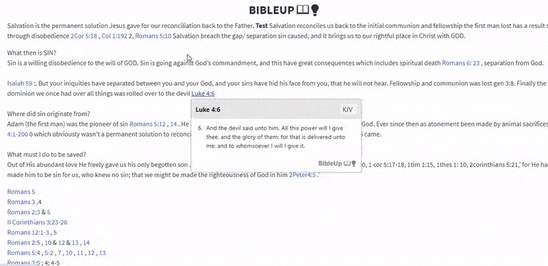

<h1 align="center">BibleUp 📖💡</h1>

<p align="center">
BibleUp transforms all bible references on a webpage (1 Timothy 2:7, John 3:16) into links and makes the text accessible via a hover popup.<br>
</p>

	
# Introduction 💫
BibleUp makes bible references on a webpage easily accessible without the need of opening on a new window.

It searches for all bible references on a page and transforms each one to a link. Hovering on these links will make the bible text accessible via a feature-rich and flexible hover popup.

At its core, BibleUp is a blend of an internal API and a display interface.

# Getting Started 🚀
## <script> include
To integrate BibleUp using the script tag, put the following code at the bottom of ```body``` 
```javascript
<script src="cdn.jsdelivr.net/npm/bibleup"></script>
```
## ES Module
BibleUp also ships with native ES module build on browser supporting the ES6 import statement
Simply put the following at the top of your javascript file.
```javascript
import BibleUp from "https://skypack.com/bibleup
```
## NPM
Install package locally from NPM
```
$ npm install bibleup
```

# Usage ⚡
After installing, create a BibleUp instance using the ```create``` method.
```javascript
let body = document.querySelector(body);
let bibleup = new BibleUp(body);
bibleup.create();
```
A BibleUp instance accepts two arguments: 
- The selector: A typical HTMLElement
- The Instance Object: An object that defines BibleUp behaviour
```javascript
let bibleup = new BibleUp(body, {
// all default values
version: 'KJV',
linkStyle: 'classic',
popup: 'classic',
darkTheme: false,
bu_ignore: ['H1', 'H2', 'H3', 'H4', 'H5', 'H6', 'IMG', 'A'],
bu_allow: []
});
```

## Options
### version
Bible version to display on hover. BibleUp currently supports only 5 versions: KJV, ASV, BBE, WEB and YLT<br>
Default: KJV

### linkStyle
BibleUp ships with different link styles: classic, underline, style1, style2<br>
Default: classic

You can replace these with your custom css style. Use the following selector
```css
#bu-link-all.bu-link.myStyle {
...
}
```
```javascript
let bibleup = new BibleUp(body, {
linkStyle: 'myStyle'
})
```

### darkTheme
A boolean to toggle dark theme on popup<br>
Default: false

### popup
BibleUp popup style. Check out the [Themes documentation](./docs/themes.md) for a list of popup styles<br>
Default: classic

### bu_allow
BibleUp ignores bible references on the following elements by default: H1 - H6, IMG, A, INPUT, SELECT, TEXTAREA, SCRIPT. Use this option to look up certain elements
Type: array
```javascript
let bibleup = new BibleUp(body, {
bu_allow: ['H4','H5'] //allow references on h4 and h5 tags
})
```
## Methods
### create()
Put BibleUp to work using the ```create()``` method. This method doesn't accept any argument.

### getOptions()
A getter method that returns all active BibleUp options. Use ```JSON.stringify()``` to parse to string
```javascript
console.log(bibleup.getOptions) //[object Object], 
```

# Behaviour ✔️
Check out all bible abbreviations, their aliases and guidelines here: [Bible citations](./docs/guidelines.md)

The following are tested bible citations:
John 3:16 ✔️<br>
Romans 4:5-6 ✔️<br>
Acts 1:8, 10, 12 ✔️<br>
Jn. 3:3, 6-9 ✔️<br>
1 cor 1:1 ❌ 1 Cor 1:1 ✔️<br>

All bible books must start with a capital letter. Check the [guidelines](./docs/guidelines.md) for more details

# Contributions
Push requests and issues are always welcomed.
Kindly make sure you state the specifics in details, whether a bug, feature requests or a fix.<br>
Thank you!

